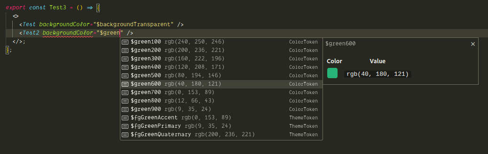

# @nderscore/tamagui-typescript-plugin

Typescript Language Server Plugin for [Tamagui](https://tamagui.dev).

## Features

- Show Tamagui theme/token values in TypeScript autocomplete suggestions

- Graphical previews for color and theme tokens

- Automatically reloads when your config is updated by the Tamagui compiler

### Screenshots





## Setup

1. Install `@nderscore/tamagui-typescript-plugin` package in your project:

   ```sh
   yarn add @nderscore/tamagui-typescript-plugin
   # or
   pnpm add @nderscore/tamagui-typescript-plugin
   # or
   npm add @nderscore/tamagui-typescript-plugin
   ```

1. Add plugin to your `tsconfig.json` with settings:

   ```json
   {
     "compilerOptions": {
       // ...
       "plugins": [
         {
           "name": "@nderscore/tamagui-typescript-plugin",

           // fill in relative or absolute path to a tamagui app here (parent folder of .tamagui)
           "pathToApp": "apps/next",

           // choose default theme for inline values of theme tokens
           "defaultTheme": "light"
         }
       ]
     }
   }
   ```

1. Make sure your VSCode is configured to use typescript from your workspace:

   - Open VSCode `Command Palette` -> `Select Typescript Version...` -> `Use Workspace Version`

## Contributing

If you would like to contribute to this project, please see the [contributing guide](./CONTRIBUTING.md).
